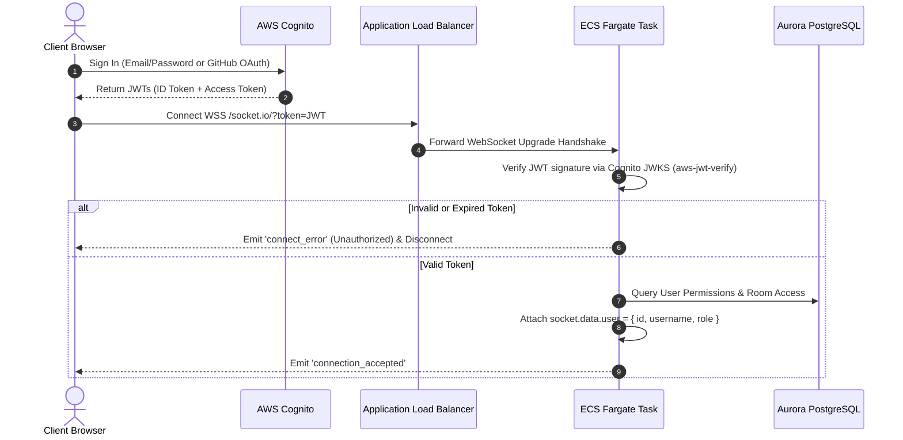
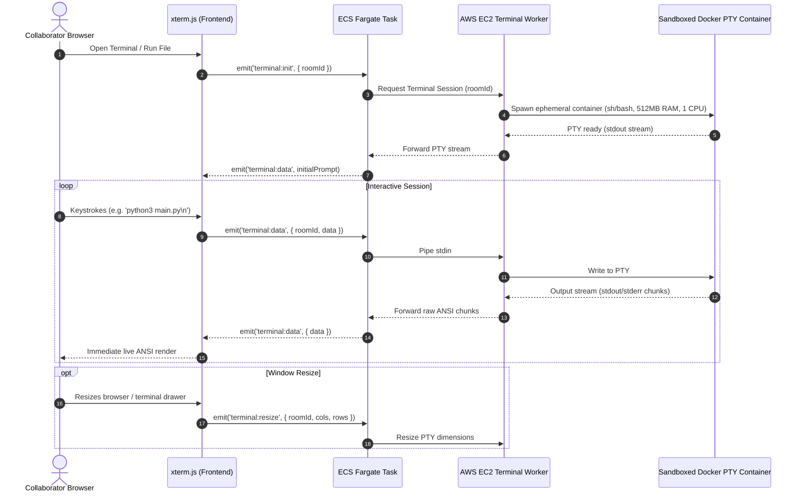

# CollabNet → AWS: Production Architecture & Implementation Blueprint

---

## 1. Executive Summary & Current State Audit

CollabNet is a full-stack collaborative IDE supporting real-time multi-cursor editing, collaborative whiteboarding (tldraw), P2P video/voice calls (simple-peer), and interactive multi-language code execution via an AWS Cloud Terminal. 

In its current state, CollabNet functions effectively as a local development prototype. However, deploying it to production on AWS introduces immediate failure points across networking, state synchronization, security, and scalability.

### Current State vs. Production Readiness

| Subsystem | Current Local Implementation | Production Failure Point | Target AWS Architecture |
|---|---|---|---|
| **Frontend** | React 19 + Vite SPA, served via `npm run dev` | No global CDN edge caching, unoptimized routing, exposed API endpoints | **S3 + CloudFront** with Route 53 & ACM TLS cert |
| **Backend** | Single Express + Socket.IO process, in-memory array (`userSocketMap: User[]`) | Cannot scale horizontally. Multi-task deployments fail as users land on different nodes without state sync | **ECS Fargate** (2+ tasks) behind an **Application Load Balancer (ALB)** with sticky sessions |
| **State Sync** | None (Node.js RAM only) | Process crash or scale event drops all room state, users, and cursor positions | **ElastiCache for Redis** (`@socket.io/redis-adapter`) for cross-node event broadcasting |
| **Database** | None | Rooms, files, chat history, and whiteboard snapshots vanish on restart | **Amazon Aurora Serverless v2 (PostgreSQL)** + optional **DynamoDB** for append-only chat logs |
| **Code Execution & Terminal** | Direct client HTTP call to `localhost:2000` (Piston) or public API | Static HTTP execution lacks interactive stdin, REPLs, debugging, and terminal CLI tools. Exposing Piston publicly introduces rate-limits and security risks | **Interactive AWS Terminal Worker (EC2 + Sandboxed Docker PTY)** streamed over bi-directional WebSockets (`xterm.js` ↔ Socket.IO ↔ EC2 Worker) with strict cgroups quotas, non-root execution, and metadata blocking |
| **Video / Voice** | WebRTC mesh (`simple-peer`), signaling via Socket.IO, zero TURN servers | Calls fail for 20–30% of users behind symmetric NATs / corporate firewalls. Mesh bandwidth explodes at $O(N^2)$, degrading past 4–6 participants | **Coturn on EC2 in Public Subnet** with Elastic IP, or **LiveKit SFU / Amazon Chime SDK** |
| **Auth & Security** | Free-form username string, no authentication, no room privacy, permissive CORS | Anyone can impersonate users, overwrite files, or eavesdrop on rooms. No rate limiting | **Amazon Cognito User Pools** + JWT validation via `aws-jwt-verify` in Socket.IO connection handshake |
| **Storage & Assets** | In-memory only | No project persistence, asset uploads, or whiteboard snapshot retention | **Amazon S3** utilizing **Direct Presigned URLs** to prevent saturating the Node.js event loop |
| **AI Copilot** | Client-side direct call to third-party public Pollinations AI API | Unauthenticated, unmonitored external dependency with unpredictable latency and zero privacy guarantees | **Amazon Bedrock** (Anthropic Claude 3.5 Sonnet / Haiku or Llama 3) via backend streaming API |
| **Observability & Ops** | `console.log`, no metrics, no CI/CD | Blind to connection drops, socket latency spikes, and execution crashes | **CloudWatch Logs, Metrics & Alarms**, AWS WAF, and **GitHub Actions** CI/CD |

---

## 2. Architectural Gap Analysis & Critical Risks

### Risk 1: WebRTC Relay & Mesh Topology Limits
- **The Issue**: WebRTC direct P2P connections require STUN to discover public IP addresses. However, when users are behind symmetric NATs or corporate firewalls, P2P connections fail completely without a **TURN relay server**.
- **The Mesh Problem**: Mesh topology sends $N-1$ outbound video streams per participant. With 6 participants at 1.5 Mbps, each client uploads 7.5 Mbps and downloads 7.5 Mbps, exhausting consumer broadband and client CPU.
- **Remediation**: 
  - *Short-term*: Coturn TURN server deployed with an Elastic IP in a **Public Subnet** (NOT in a private subnet behind a NAT Gateway, which cannot handle unsolicited incoming UDP packets).
  - *Long-term*: Transition from mesh (`simple-peer`) to an SFU (Selective Forwarding Unit) such as **LiveKit** or **Amazon Chime SDK**, reducing client upload to $O(1)$.

### Risk 2: Socket.IO Horizontal Scaling & Transport Negotiation
- **The Issue**: Socket.IO connections begin with HTTP long-polling and upgrade to WebSockets. Without sticky sessions, sequential HTTP polling requests hit different ECS tasks, causing handshake failures (`400 Bad Request: Session ID unknown`).
- **The Pub/Sub Problem**: When Task A receives a `CODE_CHANGE` event from User 1, User 2 connected to Task B will never receive it unless an inter-process message bus coordinates room broadcasts.
- **Remediation**:
  - Deploy **ElastiCache Redis** using `@socket.io/redis-adapter` or `@socket.io/redis-streams-adapter`.
  - Enable **ALB Sticky Sessions** (cookie-based), OR configure the client to enforce pure WebSocket transport (`transports: ['websocket']`).

### Risk 3: Arbitrary Code Execution & Terminal Sandbox Security
- **The Issue**: Providing an open interactive terminal (running bash, sh, python, gcc, node) on AWS infrastructure exposes attack vectors: crypto-mining, fork-bombs, memory exhaustion, scanning internal VPC resources (RDS/Redis), or querying the AWS EC2 Instance Metadata Service (`169.254.169.254`) to steal IAM credentials.
- **Remediation**:
  - Run terminal sessions inside lightweight, unprivileged Docker containers on a dedicated EC2 Worker instance in an isolated private subnet.
  - Apply strict cgroups limits (`pids-limit 100`, memory limit 512MB, CPU quota 1.0 core).
  - Enforce iptables rules blocking container bridge access to `169.254.169.254` and VPC internal database CIDRs.
  - Route all bi-directional terminal input/output through Socket.IO authenticated channels with per-room session bounds.

---

## 3. AWS Target Service Mapping

| Component | AWS Service | Configuration Details |
|---|---|---|
| **Static Frontend Hosting** | **S3 + CloudFront** | S3 bucket blocked from public access; CloudFront Origin Access Control (OAC); SPA custom error response (403/404 → `/index.html`) |
| **DNS & TLS** | **Route 53 + AWS Certificate Manager (ACM)** | Wildcard public SSL/TLS certificates attached to CloudFront and ALB |
| **Socket.IO Backend API** | **ECS Fargate (vCPU: 1.0, RAM: 2GB)** | Multi-AZ task placement (min 2 tasks) behind an Application Load Balancer |
| **Load Balancing** | **Application Load Balancer (ALB)** | HTTPS (443) listener with sticky sessions enabled (`AWSALB` cookie); WebSocket upgrade support; health check `/healthz` |
| **Room State & Pub/Sub** | **ElastiCache for Redis (Cluster Mode Disabled)** | Multi-AZ with automatic failover, in-transit encryption (TLS), Redis AUTH token |
| **Relational Persistence** | **Amazon Aurora Serverless v2 (PostgreSQL)** | Auto-scales 0.5–8 ACUs; stores users, rooms, permissions, projects, and file trees |
| **High-Volume Chat Logs** | **DynamoDB** (or Aurora PostgreSQL) | Partition Key: `room_id`, Sort Key: `timestamp` with TTL for automatic cleanup |
| **Authentication & RBAC** | **Amazon Cognito User Pools** | Handles signup, login, OAuth (GitHub/Google), and issues RS256-signed JWTs |
| **File & Asset Storage** | **Amazon S3** | Direct presigned `putObject`/`getObject` URLs for file uploads and whiteboard backups |
| **Interactive Cloud Terminal** | **EC2 (`t3.medium` / `c6i.large`)** | Running containerized PTY worker daemon; isolated in private subnet; manages ephemeral sandboxed container shells per room |
| **WebRTC TURN/STUN** | **EC2 (`t3.small`) with Coturn** | Placed in **Public Subnet** with Elastic IP; Security Group allowing UDP/TCP 3478, 5349, and relay ports 49152–65535 |
| **AI Assistant / Copilot** | **Amazon Bedrock** | Anthropic Claude 3.5 Sonnet / Haiku invoked via backend streaming route (`/api/ai/copilot`) |
| **Edge Security** | **AWS WAF** | Attached to CloudFront and ALB; rate limiting on `/socket.io/` and API endpoints, AWS Managed Rules (Common & Known Bad Inputs) |
| **Secrets Management** | **AWS Secrets Manager** | Securely supplies DB credentials, Redis AUTH, and Cognito keys to ECS tasks |
| **Monitoring & Alarms** | **CloudWatch Logs & Metrics** | Centralized container logging (`awslogs`), p95 socket latency alarms, ALB 5xx alerts |

---

## 4. Production Architecture Topology

### 4.1 Master Network & Infrastructure Diagram

```mermaid
flowchart TB
    Client[Browser / Client App]
    
    subgraph Edge[Edge & Security Layer]
        R53[Route 53 DNS]
        ACM[ACM TLS Certificate]
        WAF[AWS WAF]
        CF[CloudFront CDN]
    end

    subgraph VPC[AWS Custom VPC: 10.0.0.0/16]
        subgraph PublicSubnets[Public Subnets: 10.0.1.0/24, 10.0.2.0/24]
            ALB[Application Load Balancer\nSticky Sessions Enabled]
            COTURN[EC2: Coturn TURN/STUN\nElastic IP Attached]
            NAT[NAT Gateway or fck-nat]
        end

        subgraph PrivateAppSubnets[Private App Subnets: 10.0.10.0/24, 10.0.20.0/24]
            ECS1[ECS Fargate Task 1\nExpress + Socket.IO]
            ECS2[ECS Fargate Task 2\nExpress + Socket.IO]
        end

        subgraph PrivateDataSubnets[Private Isolated Subnets: 10.0.30.0/24, 10.0.40.0/24]
            REDIS[(ElastiCache Redis\nSocket.IO Adapter)]
            AURORA[(Aurora Serverless v2\nPostgreSQL)]
            TERMINAL[EC2: AWS Terminal Worker\nSandboxed Container PTYs]
        end
    end

    subgraph ManagedServices[AWS Managed Services]
        COGNITO[Amazon Cognito\nUser Pool & OAuth]
        S3_FE[S3 Bucket\nStatic Frontend]
        S3_ASSETS[S3 Bucket\nProjects & Whiteboard Data]
        BEDROCK[Amazon Bedrock\nClaude 3.5 Sonnet]
        SM[AWS Secrets Manager]
        CW[CloudWatch Monitoring]
    end

    %% Client Routing
    Client -->|1. Resolve DNS| R53
    Client -->|2. HTTPS / Static Assets| CF
    CF -->|Origin Request via OAC| S3_FE
    Client -->|3. Authenticate| COGNITO
    Client -->|4. WSS / API Traffic & xterm.js Stream| ALB
    WAF -.->|Inspect / Filter| CF
    WAF -.->|Inspect / Filter| ALB
    Client <===>|5. WebRTC Media Relay\nUDP 49152-65535| COTURN

    %% VPC Routing
    ALB -->|Forward WSS/HTTP| ECS1
    ALB -->|Forward WSS/HTTP| ECS2
    ECS1 <===>|Cross-Node Pub/Sub| REDIS
    ECS2 <===>|Cross-Node Pub/Sub| REDIS
    ECS1 --->|Queries & Writes| AURORA
    ECS2 --->|Queries & Writes| AURORA
    ECS1 <===>|Bi-directional PTY WebSocket Stream| TERMINAL
    ECS2 <===>|Bi-directional PTY WebSocket Stream| TERMINAL
    
    %% Outbound / External Services
    ECS1 -.->|Generate Presigned URLs| S3_ASSETS
    ECS2 -.->|Generate Presigned URLs| S3_ASSETS
    ECS1 -.->|Invoke Streaming AI| BEDROCK
    ECS2 -.->|Invoke Streaming AI| BEDROCK
    ECS1 -.->|Fetch Secrets on Boot| SM
    ECS1 -.->|Ship Container Logs| CW
    ECS1 -.->|Outbound API Calls via| NAT
```



---

## 5. Subsystem Deep Dives & Engineering Specifications

### 5.1 Real-Time Socket.IO & Redis Adapter

To scale past a single instance, backend tasks must communicate via Redis pub/sub:

```typescript
// server/src/lib/socketServer.ts
import { Server } from "socket.io"
import { createAdapter } from "@socket.io/redis-adapter"
import Redis from "ioredis"

const pubClient = new Redis({
  host: process.env.REDIS_HOST,
  port: Number(process.env.REDIS_PORT) || 6379,
  password: process.env.REDIS_PASSWORD,
  tls: process.env.NODE_ENV === "production" ? {} : undefined,
})
const subClient = pubClient.duplicate()

export function configureSocketIO(httpServer: any) {
  const io = new Server(httpServer, {
    adapter: createAdapter(pubClient, subClient),
    cors: {
      origin: process.env.CLIENT_ORIGIN || "https://collabnet.yourdomain.com",
      credentials: true,
    },
    transports: ["websocket", "polling"],
    pingTimeout: 30000,
    pingInterval: 25000,
  })
  return io
}
```

#### ALB Sticky Session Requirement
When both `websocket` and `polling` transports are enabled, ALB target groups must have sticky sessions enabled:
- **Stickiness Type**: Application-based or Duration-based (LBCookie).
- **Cookie Duration**: 86400 seconds (1 day).
- If client is configured with `transports: ['websocket']` exclusively, sticky sessions can be disabled, allowing pure round-robin socket balancing.

---

### 5.2 Authentication & Socket.IO Handshake Security

In production, connection requests must prove identity before a socket connects:



#### Server Middleware Implementation Pattern:
```typescript
import { CognitoJwtVerifier } from "aws-jwt-verify"

const verifier = CognitoJwtVerifier.create({
  userPoolId: process.env.COGNITO_USER_POOL_ID!,
  tokenUse: "access",
  clientId: process.env.COGNITO_CLIENT_ID!,
})

io.use(async (socket, next) => {
  const token = socket.handshake.auth?.token || socket.handshake.headers?.authorization?.replace("Bearer ", "")
  if (!token) {
    return next(new Error("AUTHENTICATION_REQUIRED"))
  }
  try {
    const payload = await verifier.verify(token)
    socket.data.user = {
      sub: payload.sub,
      username: payload.username,
    }
    next()
  } catch (err) {
    next(new Error("INVALID_TOKEN"))
  }
})
```

---

### 5.3 Concrete Relational Database Schema (PostgreSQL)

To replace ephemeral in-memory state, the following relational schema must be deployed on **Aurora Serverless v2**:

```sql
-- Users table synchronized with Cognito User Pool
CREATE TABLE users (
    id UUID PRIMARY KEY DEFAULT gen_random_uuid(),
    cognito_sub VARCHAR(64) UNIQUE NOT NULL,
    email VARCHAR(255) UNIQUE NOT NULL,
    username VARCHAR(64) UNIQUE NOT NULL,
    avatar_url TEXT,
    created_at TIMESTAMPTZ DEFAULT NOW(),
    updated_at TIMESTAMPTZ DEFAULT NOW()
);

-- Collaboration Rooms
CREATE TABLE rooms (
    id UUID PRIMARY KEY DEFAULT gen_random_uuid(),
    slug VARCHAR(64) UNIQUE NOT NULL,
    name VARCHAR(128) NOT NULL,
    owner_id UUID NOT NULL REFERENCES users(id) ON DELETE CASCADE,
    is_private BOOLEAN DEFAULT FALSE,
    password_hash VARCHAR(255),
    max_members INT DEFAULT 20,
    created_at TIMESTAMPTZ DEFAULT NOW(),
    updated_at TIMESTAMPTZ DEFAULT NOW()
);

-- Room Members & Role-Based Access Control
CREATE TYPE member_role AS ENUM ('owner', 'editor', 'viewer');
CREATE TABLE room_members (
    room_id UUID NOT NULL REFERENCES rooms(id) ON DELETE CASCADE,
    user_id UUID NOT NULL REFERENCES users(id) ON DELETE CASCADE,
    role member_role NOT NULL DEFAULT 'editor',
    joined_at TIMESTAMPTZ DEFAULT NOW(),
    last_active_at TIMESTAMPTZ DEFAULT NOW(),
    PRIMARY KEY (room_id, user_id)
);

-- Project File Structure
CREATE TABLE project_files (
    id UUID PRIMARY KEY DEFAULT gen_random_uuid(),
    room_id UUID NOT NULL REFERENCES rooms(id) ON DELETE CASCADE,
    name VARCHAR(255) NOT NULL,
    path VARCHAR(1024) NOT NULL,
    content TEXT NOT NULL DEFAULT '',
    language VARCHAR(64) NOT NULL,
    version INT NOT NULL DEFAULT 1,
    last_modified_by UUID REFERENCES users(id),
    created_at TIMESTAMPTZ DEFAULT NOW(),
    updated_at TIMESTAMPTZ DEFAULT NOW(),
    UNIQUE (room_id, path)
);

-- Whiteboard Canvas Snapshots (tldraw)
CREATE TABLE whiteboard_snapshots (
    id UUID PRIMARY KEY DEFAULT gen_random_uuid(),
    room_id UUID NOT NULL REFERENCES rooms(id) ON DELETE CASCADE,
    snapshot_s3_key VARCHAR(512),
    schema_version INT NOT NULL DEFAULT 1,
    updated_at TIMESTAMPTZ DEFAULT NOW()
);

-- Indexes for Fast Lookups
CREATE INDEX idx_files_room_id ON project_files(room_id);
CREATE INDEX idx_room_members_user ON room_members(user_id);
CREATE INDEX idx_rooms_slug ON rooms(slug);
```

---

### 5.4 Interactive AWS Cloud Terminal & Code Execution Architecture

Instead of static HTTP code execution via Piston, CollabNet utilizes an **interactive AWS Cloud Terminal** powered by `xterm.js` on the frontend, bi-directional Socket.IO streaming on the backend, and an **AWS EC2 Terminal Worker** hosting sandboxed container PTYs:



#### Security Guardrails on the AWS Terminal Worker:
1. **Container Jail**: Each room session runs within a dedicated container (`user: 1000:1000`, `--network bridge` or restricted egress, `/tmp` restricted).
2. **Strict Resource Quotas (cgroups)**:
   - Max PIDs: 100 (eliminates fork bombs).
   - Max Memory: 512 MB per session container.
   - Max CPU: 1.0 vCPU core.
3. **IAM Metadata Block**: Host `iptables` rule drops all packets directed at `169.254.169.254` originating from Docker bridge interfaces:
   ```bash
   iptables -I DOCKER-USER -d 169.254.169.254 -j DROP
   ```
4. **Automatic Reaping**: Inactive sessions automatically terminate after 15 minutes of idle time.

---

### 5.5 WebRTC Media: Coturn vs. Modern SFU Comparison

| Dimension | Option A: Coturn Mesh Relay (Current Plan) | Option B: Managed SFU (LiveKit / Chime SDK) |
|---|---|---|
| **Architecture** | Client P2P Mesh with Coturn relay fallback | Centralized media router (SFU) |
| **Participant Limit** | 4–6 participants maximum before video freezes | 50+ participants per room with adaptive simulcast |
| **Client Bandwidth** | $O(N^2)$ (each client sends stream to every other peer) | $O(1)$ upload, $O(N)$ download (downscaled by SFU) |
| **AWS Deployment** | EC2 in **Public Subnet** with Elastic IP; needs manual maintenance | LiveKit Cloud / ECS container or AWS Chime SDK API |
| **Cost Profile** | High AWS data egress ($0.09/GB) for all relayed video | Predictable per-minute or bandwidth pricing |
| **Recommendation** | Acceptable for MVP 2–3 user pairing | **Strongly recommended** for any real-world production group call |

#### Correct Coturn EC2 Setup (Public Subnet):
```ini
# /etc/turnserver.conf
listening-port=3478
tls-listening-port=5349
min-port=49152
max-port=65535
realm=turn.collabnet.yourdomain.com
use-auth-secret
static-auth-secret=YOUR_ROTATING_TURN_SECRET
fingerprint
lt-cred-mech
external-ip=YOUR_PUBLIC_ELASTIC_IP
```

---

### 5.6 File & Whiteboard Storage via S3 Presigned URLs

Streaming large code repositories or whiteboard vector exports through Socket.IO blocks Node's event loop. Instead, the backend generates temporary presigned URLs:

1. **Upload Flow**:
   - Client emits `REQUEST_SNAPSHOT_UPLOAD` to backend.
   - Backend checks room permissions and calls `@aws-sdk/s3-request-presigner` (`putObjectCommand`).
   - Client performs HTTP `PUT` directly to S3 with pre-signed authorization header.
   - Client emits `SNAPSHOT_UPLOAD_COMPLETED` with S3 key.
2. **Download Flow**:
   - Collaborators join room and request whiteboard state.
   - Backend returns presigned `getObject` URL.
   - Client fetches state directly from CloudFront/S3 edge cache.

---

### 5.7 AI Copilot via Amazon Bedrock

Replace public Pollinations API with enterprise-grade, low-latency Amazon Bedrock:

```typescript
// server/src/api/aiCopilot.ts
import { BedrockRuntimeClient, InvokeModelWithResponseStreamCommand } from "@aws-sdk/client-bedrock-runtime"

const bedrock = new BedrockRuntimeClient({ region: process.env.AWS_REGION || "us-east-1" })

export async function streamCodeCompletion(prompt: string, contextCode: string, res: express.Response) {
  const payload = {
    anthropic_version: "bedrock-2023-05-31",
    max_tokens: 2048,
    messages: [
      {
        role: "user",
        content: `You are an expert pair-programmer in CollabNet IDE.\nContext:\n${contextCode}\n\nTask: ${prompt}`,
      },
    ],
  }

  const command = new InvokeModelWithResponseStreamCommand({
    modelId: "anthropic.claude-3-5-sonnet-20240620-v1:0",
    contentType: "application/json",
    accept: "application/json",
    body: JSON.stringify(payload),
  })

  const response = await bedrock.send(command)
  res.setHeader("Content-Type", "text/event-stream")
  res.setHeader("Cache-Control", "no-cache")

  if (response.body) {
    for await (const item of response.body) {
      if (item.chunk) {
        const decoded = JSON.parse(new TextDecoder().decode(item.chunk.bytes))
        if (decoded.type === "content_block_delta") {
          res.write(`data: ${JSON.stringify({ text: decoded.delta?.text })}\n\n`)
        }
      }
    }
  }
  res.end()
}
```

---

## 6. Real-World AWS Cost Analysis & Optimization Playbook

### The AWS NAT Gateway Trap
- **The Problem**: A standard AWS NAT Gateway costs **$32.40/month per AZ** + **$0.045/GB data processing**. A 2-AZ multi-subnet architecture costs **$65–$100/month baseline** even with zero traffic!
- **Solo / MVP Optimization Options**:
  1. **Option 1 (`fck-nat` EC2 Instance)**: Run a single `t4g.nano` or `t4g.micro` NAT instance using the open-source `fck-nat` AMI. Cost: **~$3.20/month** (over 90% savings).
  2. **Option 2 (VPC Endpoints + Public ECS Tasks)**: Place ECS tasks in public subnets with public IPs, but configure Security Groups to allow inbound traffic **ONLY from the ALB Security Group**. Use AWS Gateway Endpoints for S3 (free) and Interface Endpoints for ECR, eliminating NAT Gateway entirely.

### Monthly Cost Projections

| Layer | MVP / Solo Dev ($/mo) | Mid-Scale Production ($/mo) |
|---|---|---|
| **Frontend CDN (CloudFront + S3)** | ~$1.00 (within Free Tier) | ~$15.00 |
| **Backend Compute (ECS Fargate)** | 1 task (0.5 vCPU, 1GB RAM) = ~$15.00 | 2–4 auto-scaling tasks = ~$60.00 |
| **ALB** | ~$18.00 + LCU fees (~$22.00) | ~$35.00 |
| **Redis (ElastiCache)** | `cache.t4g.micro` (1 node) = ~$13.00 | `cache.t4g.small` (Multi-AZ) = ~$52.00 |
| **Database (Aurora PostgreSQL)** | Serverless v2 (0.5 ACU min) = ~$43.00 | Serverless v2 (1–4 ACUs) = ~$120.00 |
| **Terminal Worker (EC2)** | 1x `t3.medium` spot/on-demand = ~$15.00–$30.00 | 1x `c6i.large` dedicated = ~$60.00 |
| **WebRTC Relay (Coturn EC2)** | 1x `t3.micro` = ~$8.00 + egress | 1x `t3.small` + egress (~$25.00) |
| **NAT Solution** | `fck-nat` (`t4g.nano`) = ~$3.20 | 2x AWS NAT Gateways = ~$65.00+ |
| **Total Estimated Cost** | **~$120.00 – $145.00 / month** | **~$430.00 – $550.00 / month** |

---

## 7. Infrastructure as Code (IaC) Blueprint

The entire stack should be provisioned via **AWS CDK (TypeScript)**. The repository structure is organized into modular stacks:

```
infra/
├── bin/
│   └── app.ts                      # CDK Entrypoint
├── lib/
│   ├── network-stack.ts            # VPC, Subnets, NAT / fck-nat, Security Groups
│   ├── data-stack.ts               # Aurora Serverless v2, ElastiCache Redis, S3
│   ├── auth-stack.ts               # Cognito User Pool, App Clients, Identity Pool
│   ├── compute-stack.ts            # ECS Cluster, Fargate Task Def, ALB, Target Groups
│   ├── execution-stack.ts          # EC2 Terminal Worker Sandbox, EC2 Coturn TURN Server
│   ├── frontend-stack.ts           # CloudFront Distribution, S3 Frontend Bucket, ACM
│   └── monitoring-stack.ts         # CloudWatch Dashboard, Alarms, SNS Topic
├── cdk.json
└── package.json
```

---

## 8. Production CI/CD Pipeline (GitHub Actions)

A zero-downtime deployment pipeline is defined in `.github/workflows/deploy.yml`:

```yaml
name: Deploy CollabNet to AWS

on:
  push:
    branches: [main]

permissions:
  id-token: write
  contents: read

jobs:
  build-and-deploy:
    runs-on: ubuntu-latest
    steps:
      - name: Checkout Repository
        uses: actions/checkout@v4

      - name: Configure AWS Credentials (OIDC)
        uses: aws-actions/configure-aws-credentials@v4
        with:
          role-to-assume: arn:aws:iam::ACCOUNT_ID:role/GitHubActionsECRDeploymentRole
          aws-region: us-east-1

      - name: Login to Amazon ECR
        id: login-ecr
        uses: aws-actions/amazon-ecr-login@v2

      - name: Build and Push Server Image
        env:
          ECR_REGISTRY: ${{ steps.login-ecr.outputs.registry }}
          IMAGE_TAG: ${{ github.sha }}
        run: |
          docker build -t $ECR_REGISTRY/collabnet-server:$IMAGE_TAG -t $ECR_REGISTRY/collabnet-server:latest ./server
          docker push $ECR_REGISTRY/collabnet-server:$IMAGE_TAG
          docker push $ECR_REGISTRY/collabnet-server:latest

      - name: Build and Deploy Frontend to S3/CloudFront
        env:
          VITE_SERVER_URL: https://api.collabnet.yourdomain.com
          VITE_COGNITO_USER_POOL_ID: ${{ secrets.COGNITO_USER_POOL_ID }}
          VITE_COGNITO_CLIENT_ID: ${{ secrets.COGNITO_CLIENT_ID }}
        run: |
          cd client
          npm ci
          npm run build
          aws s3 sync dist/ s3://collabnet-frontend-bucket --delete
          aws cloudfront create-invalidation --distribution-id ${{ secrets.CF_DISTRIBUTION_ID }} --paths "/*"

      - name: Deploy New Task Definition to ECS Fargate
        run: |
          aws ecs update-service --cluster collabnet-cluster --service collabnet-backend-service --force-new-deployment
```

---

## 9. Phased Implementation Roadmap

### Phase 1: Containerization & Single-Instance Deployment (Immediate)
- [x] Create production multi-stage `Dockerfile` and `.dockerignore` for `server/`.
- [x] Create production multi-stage `Dockerfile` and `.dockerignore` for `client/` (Nginx SPA).
- [x] Add `/healthz` and `/readyz` endpoints to Express backend for ALB health checking.
- [x] Provide unified `docker-compose.yml` for local multi-service testing (client, server, redis).

### Phase 2: Database Persistence & Cross-Node Synchronization
- [ ] Deploy Aurora Serverless v2 PostgreSQL instance and run migration script.
- [ ] Refactor `server/src/types/server.ts` to replace in-memory arrays (`userSocketMap`) with Prisma/Drizzle DB queries.
- [ ] Connect `@socket.io/redis-adapter` with ElastiCache Redis.
- [ ] Stand up Application Load Balancer with sticky sessions.

### Phase 3: Auth, Sandboxed Execution & TURN Infrastructure
- [ ] Create Cognito User Pool and integrate `aws-jwt-verify` in Socket.IO middleware.
- [ ] Deploy AWS Terminal Worker on dedicated EC2 in private subnet; connect backend PTY streaming via WebSockets.
- [ ] Deploy Coturn on EC2 in Public Subnet with Elastic IP; inject TURN credentials into client WebRTC config.
- [ ] Replace Pollinations AI with Amazon Bedrock streaming route.

### Phase 4: Production Hardening & Operations
- [ ] Provision AWS WAF with rate-limiting rules on CloudFront and ALB.
- [ ] Configure CloudWatch alarms for p95 socket latency and 5xx errors.
- [ ] Configure GitHub Actions OIDC deployment workflow.
